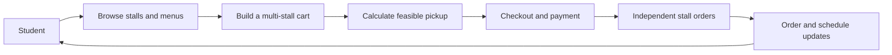

# CampusEats

<div align="center">

### Campus food, without the lunch-rush guesswork.

Pre-order from campus stalls, get a pickup time shaped by kitchen capacity, and let each stall work through a queue it can actually handle.

[](https://nodejs.org/)
[](https://nextjs.org/)
[](https://www.typescriptlang.org/)
[](https://www.postgresql.org/)

[Explore the product](PRODUCT_SPEC.md) · [Read the architecture](ARCHITECTURE.md) · [Run locally](#run-locally)

</div>

---

CampusEats is a campus dining platform built around a practical constraint: a kitchen has finite people, stations, and time. Students can browse stalls, build a multi-stall cart, and place pickup orders; stall teams manage menus and order flow; administrators handle verification and oversight.

## The flow



Pickup scheduling considers preparation workload, parallel kitchen capacity, active queue, and an operational buffer. A shared checkout is split into stall-scoped suborders, so kitchen execution can progress independently. Identity verification, payment, refunds, realtime updates, and audit records are modeled in dedicated backend modules.

## What’s here

| Surface | What it supports |
| --- | --- |
| **Student experience** | Stall and menu browsing, cart, checkout, order history and tracking, profile, and verification flows. |
| **Stall operations** | Owner dashboard, menu management, kitchen queue, and stall settings. |
| **Administration** | Student verification review, operating-hours policies, refunds, and audit views. |
| **Backend API** | Authentication, stalls, checkout and order lifecycles, verification and liveness, payments and refunds, and server-sent realtime events. |

The API currently composes mock payment and liveness providers with local document storage for development. Production integrations and deployment require environment-specific configuration; see [production setup](#operations-and-security) before exposing a deployment.

## Architecture

The backend is a TypeScript/Express modular monolith. Domain and application logic are grouped by bounded context, Prisma persists data in PostgreSQL, and the Next.js frontend proxies `/api/v1` requests to the API during development.

| Layer | Technologies |
| --- | --- |
| Web app | Next.js 16, React 19, TypeScript, Tailwind CSS |
| API | Node.js 20+, Express, TypeScript, Zod |
| Data | PostgreSQL 16, Prisma |
| Testing | Jest, Supertest |

```text
src/
  modules/       identity · stall · ordering · scheduling · payment · realtime · audit
  shared/        middleware · infrastructure · security · validation
frontend/src/
  app/           student, stall, owner, admin, checkout, and order routes
  features/      auth, cart, checkout, menus, orders, payments, realtime, and more
prisma/          schema and database migrations
tests/           unit and integration suites
docs/            production runbooks and architecture decision records
infra/storage/   object-storage policy examples
```

## Run locally

### Prerequisites

- Node.js 20 or newer and npm
- Docker with Docker Compose, or a local PostgreSQL 16 instance

### 1. Configure the API and database

```bash
git clone https://github.com/abdul78-create/CampusEats.git
cd CampusEats
npm install
cp .env.example .env
```

Set the local PostgreSQL credentials in `.env` and make sure `DATABASE_URL` uses the same values. Then start the database and prepare Prisma:

```bash
docker compose up -d postgres
npm run prisma:generate
npm run prisma:migrate
```

On Windows PowerShell, use `Copy-Item .env.example .env` for the copy command. Start the API from the repository root:

```bash
npm run dev
```

The API listens on `http://localhost:4000`. Its basic health endpoint is `http://localhost:4000/health`.

### 2. Start the web app

In a second terminal:

```bash
cd frontend
npm install
cp .env.example .env.local
npm run dev
```

Open `http://localhost:3000`. The frontend's Next.js rewrite forwards `/api/v1` calls to `http://localhost:4000` by default. To change the API host, set `NEXT_PUBLIC_API_BASE_URL` in `frontend/.env.local` and restart the dev server. In PowerShell, use `Copy-Item .env.example .env.local` from the `frontend` directory.

## Useful commands

Run backend commands from the repository root and frontend commands from `frontend/`.

| Command | Purpose |
| --- | --- |
| `npm test` | Run backend Jest tests |
| `npm run typecheck` | Type-check the backend |
| `npm run build` | Compile the backend to `dist/` |
| `npm run prisma:generate` | Generate the Prisma client |
| `npm run lint` | Lint the frontend |
| `npm run build` | Build the frontend for production |

The last two commands are frontend scripts; run them inside `frontend/`.

## Operations and security

- Keep `.env`, `frontend/.env.local`, credentials, and private keys out of Git. The checked-in `.env.example` files are templates, not production configuration.
- `NEXT_PUBLIC_` variables are bundled for the browser; never put secrets in them.
- Local development defaults to mock payment and liveness providers. Configure and verify production providers before accepting real payments or identity documents.
- For deployment, storage, payment, and secret-management guidance, start with [Deployment](DEPLOYMENT.md), [Secrets Management](docs/SECRETS_MANAGEMENT.md), [Payment Production Setup](docs/PAYMENT_PRODUCTION_SETUP.md), and [Object Storage Setup](docs/OBJECT_STORAGE_SETUP.md).

## Documentation

| Topic | Guide |
| --- | --- |
| Product scope and business rules | [Product specification](PRODUCT_SPEC.md) · [Stall operations](STALL_OPERATIONS.md) |
| System structure and data | [Architecture](ARCHITECTURE.md) · [Domain model](DOMAIN_MODEL.md) · [Database schema](DATABASE_SCHEMA.md) |
| Orders and pickup | [Order state machine](ORDER_STATE_MACHINE.md) · [Scheduling engine](SCHEDULING_ENGINE.md) |
| Identity and access | [Authentication](AUTHENTICATION.md) · [Identity verification](IDENTITY_VERIFICATION.md) · [Security](SECURITY.md) |
| Payments and audit | [Payment specification](PAYMENT_SPEC.md) · [Refund specification](REFUND_SPEC.md) · [Audit log](AUDIT_LOG_SPEC.md) |
| API and realtime | [API specification](API_SPEC.md) · [Realtime architecture](REALTIME_ARCHITECTURE.md) |
| Engineering | [Development guide](DEVELOPMENT.md) · [Test plan](TEST_PLAN.md) · [Changelog](CHANGELOG.md) · [Architecture decisions](docs/adr/) |
| Production runbooks | [Database](docs/DATABASE_PRODUCTION_SETUP.md) · [Payments](docs/PAYMENT_PRODUCTION_SETUP.md) · [Object storage](docs/OBJECT_STORAGE_SETUP.md) · [Secrets](docs/SECRETS_MANAGEMENT.md) |

---

<div align="center">

Built for campus kitchens, short breaks, and pickup times that mean something.

</div>
