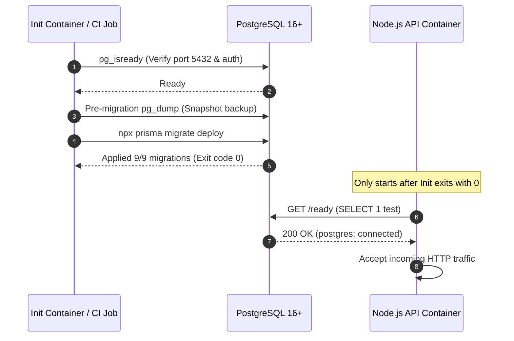

# CampusEats — Database Production Setup & Operations Specification

## 1. Executive Summary

CampusEats relies on **PostgreSQL 16+** as its authoritative relational data store, accessed through **Prisma ORM**. The data tier enforces strict ACID transactions, row-level locks on stock/inventory mutations, cryptographic audit hash chains, and multi-tenant BOLA isolation.

This document establishes the production database deployment protocol, connection configuration, migration safeguards, health/readiness probe architecture, and indexing audit.

---

## 2. Production PostgreSQL Architecture & Configuration

### 2.1 Connection String Topology
In production, database connections must use explicit TLS/SSL encryption and connection pool bounds.

```ini
DATABASE_URL=postgresql://${POSTGRES_USER}:${POSTGRES_PASSWORD}@${POSTGRES_HOST}:${POSTGRES_PORT}/${POSTGRES_DB}?schema=public&sslmode=require&connection_limit=20&pool_timeout=30
```

| Parameter | Recommended Production Value | Rationale |
| :--- | :--- | :--- |
| `sslmode` | `require` (or `verify-full`) | Enforces TLS encryption in transit. Protects credentials and student PII from network eavesdropping. |
| `connection_limit` | `20` per container | Prevents database worker starvation. Calculated as: $(\text{Instances} \times \text{connection\_limit}) < \text{PostgreSQL } \text{max\_connections}$. |
| `pool_timeout` | `30` seconds | Maximum wait time for a connection pool slot before throwing a connection acquisition error. |
| `schema` | `public` | Isolates standard application tables. |

### 2.2 Server-Side PostgreSQL Resource Allocation (Recommended for 4 vCPU / 8GB RAM host)
```ini
# Memory Configuration
shared_buffers = 2GB                  # 25% of total RAM
effective_cache_size = 6GB            # 75% of total RAM
work_mem = 32MB                       # Per-query sort/hash memory
maintenance_work_mem = 512MB          # Index creation and VACUUM memory

# Connection Constraints
max_connections = 150                 # Hard ceiling for active backend connections
superuser_reserved_connections = 3    # Preserved for DBA emergency access

# Write-Ahead Logging & Checkpoints
wal_level = replica
checkpoint_completion_target = 0.9
max_wal_size = 4GB
min_wal_size = 1GB

# Query Planner & Cost Tuning
random_page_cost = 1.1                # Optimized for NVMe/SSD storage
effective_io_concurrency = 200        # Concurrent asynchronous disk operations
```

### 2.3 Database User Least Privilege Model
The application container connects using a non-superuser account (`campuseats_prod_user`).

```sql
-- 1. Create dedicated application role
CREATE ROLE campuseats_prod_user WITH LOGIN PASSWORD 'STRONG_RANDOMLY_GENERATED_PASSWORD';

-- 2. Grant connection and schema usage
GRANT CONNECT ON DATABASE campuseats_prod TO campuseats_prod_user;
GRANT USAGE, CREATE ON SCHEMA public TO campuseats_prod_user;

-- 3. Grant CRUD table and sequence privileges
GRANT SELECT, INSERT, UPDATE, DELETE ON ALL TABLES IN SCHEMA public TO campuseats_prod_user;
GRANT USAGE, SELECT, UPDATE ON ALL SEQUENCES IN SCHEMA public TO campuseats_prod_user;

-- 4. Default privileges for future migrations
ALTER DEFAULT PRIVILEGES IN SCHEMA public GRANT SELECT, INSERT, UPDATE, DELETE ON TABLES TO campuseats_prod_user;
ALTER DEFAULT PRIVILEGES IN SCHEMA public GRANT USAGE, SELECT, UPDATE ON SEQUENCES TO campuseats_prod_user;

-- 5. Explicitly revoke destructive server permissions
REVOKE ALL ON DATABASE campuseats_prod FROM PUBLIC;
-- Ensure campuseats_prod_user DOES NOT possess SUPERUSER, CREATEDB, or REPLICATION
```

### 2.4 Persistent Storage & Backup Strategy
* **Data Volume**: Must mount to high-IOPS persistent storage (e.g. AWS EBS gp3, Google Persistent Disk, or dedicated NVMe SAN).
* **Automated WAL Archiving**: Point-in-time recovery (PITR) enabled via continuous WAL archiving (e.g. pgBackRest or cloud managed backup).
* **Daily Snapshots**: Automated snapshot taken during low-traffic hours (e.g. 03:00 AM IST).

---

## 3. Prisma Production Migration Procedure

### 3.1 Strict Deployment Rules
1. **Never run `prisma migrate dev` in Production**:
   * `prisma migrate dev` is for development only. It attempts interactive schema synchronization and may reset data if drift is detected.
2. **Always run `prisma migrate deploy`**:
   * Applies all pending forward migrations recorded in `prisma/migrations/`.
   * Never prompts for interactive input.
   * Fails closed with a non-zero exit code if migration history is corrupted or database is unreachable.
3. **Immutability of Generated Client**:
   * `npx prisma generate` must be run during container build time (`Dockerfile`), never at container startup, ensuring zero external network dependency at runtime.

### 3.2 Migration Execution Sequence in Container Orchestration


---

## 4. Database Readiness vs. Liveness Architecture

CampusEats decouples process liveness from database readiness to prevent cascading restarts during transient database failovers.

### 4.1 Liveness Probe (`GET /health`)
* **Endpoint**: `/health`
* **Implementation** (`src/app.ts:198-202`):
  ```typescript
  app.get('/health', (_req: Request, res: Response) => {
    res.status(200).json({ status: 'ok' });
  });
  ```
* **Purpose**: Indicates that the Node.js event loop is alive and responding. If this fails, the container orchestrator restarts the container.

### 4.2 Readiness Probe (`GET /ready`)
* **Endpoint**: `/ready`
* **Implementation** (`src/app.ts:204-217`):
  ```typescript
  app.get('/ready', async (_req: Request, res: Response) => {
    try {
      await prisma.$queryRaw`SELECT 1`;
      res.status(200).json({ status: 'ok', postgres: 'connected' });
    } catch {
      res.status(503).json({ status: 'degraded', postgres: 'disconnected' });
    }
  });
  ```
* **Purpose**: Executes an actual shallow `SELECT 1` against PostgreSQL via `PrismaClient`.
* **Behavior**:
  * Returns `HTTP 200` if database connection is active.
  * Returns `HTTP 503` if PostgreSQL is unreachable or the connection pool is starved.
  * Ingress / Reverse Proxy (Nginx) removes degraded instances from the load balancer pool without killing the process, allowing connection recovery.

---

## 5. Comprehensive Index Verification & Query Path Audit

A thorough audit of `prisma/schema.prisma` was conducted against the top production query paths.

| Functional Area | Database Table | Index / Constraint | Query Access Pattern | Audit Result |
| :--- | :--- | :--- | :--- | :--- |
| **Authentication** | `User` | `@unique(email)`<br>`@unique(phoneNumber)`<br>`@@index([role])` | User lookup during credential login and role enforcement | ✅ **Verified** |
| **Sessions** | `RefreshSession` | `@unique(tokenHash)`<br>`@@index([userId])`<br>`@@index([familyId])` | High-frequency token refresh, single-use rotation, and family-wide replay revocation | ✅ **Verified** |
| **Student Profiles** | `StudentProfile` | `@unique(universityRegNumber)`<br>`@@index([accountStatus])` | Uniqueness of campus reg number and ordering eligibility gate | ✅ **Verified** |
| **Verification Queue** | `StudentVerification` | `@@index([studentProfileId])`<br>`@@index([status])` | Admin verification queue review (`status = 'UNDER_REVIEW'`) | ✅ **Verified** |
| **Biometrics** | `LivenessSession` | `@unique(sessionNonce)`<br>`@@index([verificationId])`<br>`@@index([status, expiresAt])` | Challenge nonce retrieval and automated session expiration cleanup | ✅ **Verified** |
| **Biometric Replay** | `LivenessEvidenceDigest` | `@unique(sha256Digest)`<br>`@@index([sha256Digest])` | Deterministic SHA-256 byte-replay prevention check during video submission | ✅ **Verified** |
| **Stalls** | `Stall` | `@@index([campusBlock])`<br>`@@index([liveStatus])`<br>`@@index([isApproved])` | Student stall discovery and filtering by block/open status | ✅ **Verified** |
| **Operating Hours** | `StallOperatingHour` | `@@unique([stallId, dayOfWeek])` | Instant daily schedule validation and kitchen availability checks | ✅ **Verified** |
| **Staff & Permissions** | `StaffAccount` | `@@index([stallId])`<br>`@@unique([staffAccountId, permission])` | Granular staff permission verification (`MANAGE_ORDERS`, `VIEW_PAYMENTS`) | ✅ **Verified** |
| **Menu Items** | `MenuItem` | `@@index([stallId])`<br>`@@index([category])`<br>`@@index([availabilityState])` | Menu browsing and item filtering | ✅ **Verified** |
| **Inventory** | `MenuItemInventory` | `@unique(menuItemId)` | Row-level locking during order checkout | ✅ **Verified** |
| **Orders** | `MasterOrder` | `@unique(orderNumber)`<br>`@@index([studentId])`<br>`@@index([status])` | Student order history and administrative order tracking | ✅ **Verified** |
| **Sub-Orders** | `SubOrder` | `@unique(subOrderNumber)`<br>`@@index([masterOrderId])`<br>`@@index([stallId])`<br>`@@index([status])` | Kitchen dashboard queries and order item aggregation | ✅ **Verified** |
| **Pickup Engine** | `PickupSchedule` | `@unique(subOrderId)`<br>`@@index([scheduledPickupTime])` | Dynamic slot capacity calculation and queue delay engine | ✅ **Verified** |
| **Payments** | `Payment` | `@unique(idempotencyKey)`<br>`@unique(providerPaymentId)`<br>`@@index([masterOrderId])`<br>`@@index([status])` | Idempotent checkout, webhook transaction lookup, and status polling | ✅ **Verified** |
| **Refunds** | `Refund` | `@unique(subOrderId)`<br>`@unique(idempotencyKey)`<br>`@@index([refundStatus])` | One refund per sub-order constraint and idempotent refund execution | ✅ **Verified** |
| **Audit Ledger** | `AuditLog` | `@unique(sequenceNumber)`<br>`@unique(currentHash)`<br>`@@index([targetEntity, targetId])`<br>`@@index([actorId])` | Tamper-evident hash chain verification and administrative forensic audit | ✅ **Verified** |
| **Realtime Outbox** | `EventOutbox` | `@@unique([channel, sequenceNumber])`<br>`@@index([channel, sequenceNumber(sort: Asc)])`<br>`@@index([publishedAt])` | SSE `Last-Event-ID` sequential replay catch-up | ✅ **Verified** |

### Index Verification Verdict
**All production-critical access paths are fully indexed.** No missing indexes or redundant indexes were identified. In strict accordance with the frozen architecture requirement, **0 modifications to `prisma/schema.prisma` are required**.

---

## 6. Operational Safeguards & Rollback Runbook

### 6.1 Pre-Migration Snapshot Requirement
Before running `npx prisma migrate deploy` during an update, operations must execute:

```bash
# Capture full pre-migration database dump
pg_dump -h $POSTGRES_HOST -p $POSTGRES_PORT -U $POSTGRES_USER -d $POSTGRES_DB -Fc -f "/backups/pre_migrate_$(date +%Y%m%d_%H%M%S).dump"
```

### 6.2 Rollback Limitations & Strategy
* **Prisma Forward-Only Model**: Prisma does not provide a native `migrate down` command.
* **Rollback Procedure**:
  1. If a migration fails mid-way, inspect error logs and verify transaction abort.
  2. If schema corruption occurs, restore from the immediate pre-migration dump:
     ```bash
     pg_restore -h $POSTGRES_HOST -p $POSTGRES_PORT -U $POSTGRES_USER -d $POSTGRES_DB --clean --if-exists "/backups/pre_migrate_TIMESTAMP.dump"
     ```
  3. In zero-downtime environments, migrations must follow expand-and-contract patterns (e.g. adding nullable columns first, migrating data, then removing deprecated columns in a subsequent release).

### 6.3 Connection Starvation Mitigation
* Set PostgreSQL `statement_timeout = '15s'` for general HTTP API requests to abort runaway analytical queries before they exhaust pool connections.
* For multi-replica deployments exceeding 100 total container connections, deploy **PgBouncer** in transaction pooling mode between the application containers and PostgreSQL.

---

## 7. Production Database Readiness Checklist

- [ ] PostgreSQL 16+ instance provisioned with SSD/NVMe persistent storage.
- [ ] Dedicated `campuseats_prod_user` created with restricted schema privileges.
- [ ] SSL enforced (`sslmode=require` or `sslmode=verify-full`).
- [ ] Database connection pool limits configured (`connection_limit=20`, `pool_timeout=30`).
- [ ] All 9 Prisma migrations verified (`npx prisma migrate status` reports 0 pending).
- [ ] Automated pre-deployment backup script verified.
- [ ] Liveness probe `/health` and Readiness probe `/ready` tested with simulated database disconnection.
