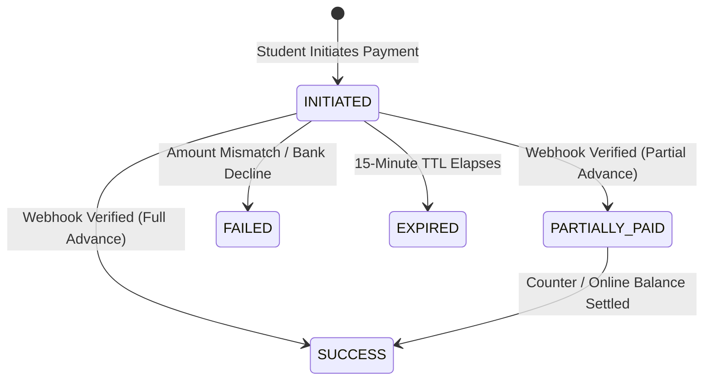

# CampusEats — Payment & UPI Production Configuration Specification

## 1. Executive Summary

CampusEats enforces a **strict backend-authoritative financial architecture**. 
Under no circumstances is any client callback, frontend simulated success, QR interaction, or user assertion permitted to confirm payments.

Settlement is proven **exclusively** through cryptographically verified, server-to-server webhook callbacks signed with HMAC-SHA256 or authorized counter settlements by designated staff.

This document details the production operational specifications, security invariants, webhook hardening standards, secret rotation protocols, and automated reconciliation procedures.

---

## 2. End-to-End Payment & Webhook Architecture

```
[Student Device]          [CampusEats API Server]          [PostgreSQL 16+]          [Bank / Aggregator]
       │                            │                             │                            │
       │ 1. POST /payments/initiate │                             │                            │
       │───────────────────────────►│                             │                            │
       │                            │ 2. Create PaymentTransaction│                            │
       │                            │    (status: INITIATED)      │                            │
       │                            │────────────────────────────►│                            │
       │                            │                             │                            │
       │ 3. Return UPI Intent & QR  │                             │                            │
       │◄───────────────────────────│                             │                            │
       │                            │                             │                            │
       │ 4. Student scans QR & pays in UPI App (GPay / PhonePe / Paytm / BHIM)                │
       │──────────────────────────────────────────────────────────────────────────────────────►│
       │                            │                             │                            │
       │                            │ 5. POST /api/v1/webhooks/payment                         │
       │                            │    (Signed Webhook Body + Headers)                       │
       │                            │◄─────────────────────────────────────────────────────────│
       │                            │                                                          │
       │                            │ 6. Verify HMAC-SHA256 & 300s Timestamp Tolerance Window  │
       │                            │ 7. Check Expected Amount vs Persistent Transaction       │
       │                            │ 8. Lock Row (SELECT ... FOR UPDATE)                      │
       │                            │ 9. Atomic State Transition:                              │
       │                            │    PaymentTransaction -> SUCCESS                         │
       │                            │    Payment -> PARTIALLY_PAID / SUCCESS                   │
       │                            │    MasterOrder -> PAYMENT_CONFIRMED                      │
       │                            │    SubOrders -> PAYMENT_CONFIRMED                        │
       │                            │    AuditLog -> PAYMENT_COMPLETED                         │
       │                            │    EventOutbox -> ORDER_PAYMENT_CONFIRMED                │
       │                            │────────────────────────────►│                            │
       │                            │                                                          │
       │ 10. SSE Push / Poll:       │                                                          │
       │     PAYMENT_CONFIRMED      │                                                          │
       │◄───────────────────────────│                                                          │
```

---

## 3. The 14 Production Payment Invariants

### 3.1 Merchant VPA Configuration
* **Parameter**: `UPI_MERCHANT_VPA` & `UPI_MERCHANT_NAME`
* **Format**: Standard NPCI UPI Intent URI:
  ```
  upi://pay?pa=${UPI_MERCHANT_VPA}&pn=${encodeURIComponent(UPI_MERCHANT_NAME)}&am=${amountRupees}&cu=INR&tr=${attemptId}
  ```
* **Production Rule**: Must use the official, verified merchant VPA provisioned by the acquiring bank (e.g. `campuseats@icici`). Never use personal VPAs in staging or production.

### 3.2 Production Payment-Provider Selection
* **Environment Variable**: `PAYMENT_PROVIDER`
* **Supported Production Aggregators**: `razorpay` | `phonepe` | `paytm`.
* **Prohibition**: `PAYMENT_PROVIDER="mock"` is strictly restricted to development and local testing. In production, live gateway SDKs/APIs handle UPI dynamic QR and intent strings.

### 3.3 Webhook Endpoint Configuration
* **Endpoint**: `POST /api/v1/webhooks/payment`
* **Network Route**: Publicly exposed through reverse proxy (HTTPS port 443).
* **Body Capture**: Raw request buffer captured verbatim via Express middleware (`req.rawBody`) before JSON parsing to preserve exact payload bytes for cryptographic signature verification.
* **Headers Required**:
  * `x-webhook-signature` (or `x-signature`): Hex-encoded HMAC-SHA256 signature.
  * `x-webhook-timestamp` (or `x-timestamp`): Epoch timestamp in seconds.

### 3.4 HMAC-SHA256 Signature Verification
* **Algorithm**: HMAC-SHA256.
* **Payload Format**: `${timestampHeader}.${rawBody}`.
* **Timing-Attack Defense**: Signature comparison utilizes `crypto.timingSafeEqual`:
  ```typescript
  crypto.timingSafeEqual(sigBuffer, expectedBuffer)
  ```
* **Security Rule**: Any payload with an invalid or missing signature is rejected with HTTP 401 Unauthorized immediately.

### 3.5 Webhook Replay Protection
Two-tier replay protection guarantees zero double-crediting:
1. **Timestamp Freshness Window**:
   $$|\text{nowEpochSeconds} - \text{timestampHeader}| \le 300 \text{ seconds (5 minutes)}$$
   Requests older than 5 minutes or skewed into the future are dropped immediately.
2. **Provider Transaction Idempotency**:
   `providerTransactionId` is uniquely constrained in PostgreSQL (`PaymentTransaction.providerTransactionId`).
   When a duplicate webhook arrives for an already-successful transaction, the system performs an idempotent short-circuit, returning `200 OK` `{ success: true, message: 'Webhook already processed (idempotent)' }` without mutating database records.

### 3.6 Idempotency Behavior
* **Checkout Mutation**: Gated by mandatory `Idempotency-Key` header (UUIDv4). Tapping "Pay" multiple times returns the existing order rather than creating duplicate orders.
* **Database Row Locking**: Webhook processing serializes competing webhook deliveries using:
  ```sql
  SELECT id FROM "PaymentTransaction" WHERE "providerTransactionId" = $1 FOR UPDATE;
  ```
  This prevents race conditions when payment aggregators retry webhooks concurrently across multiple server instances.

### 3.7 Payment Expiry Handling
* **Validity Window**: Payment attempts have a strict **15-minute TTL** (`expiresAt = Date.now() + 15 * 60 * 1000`).
* **Server-Authoritative Countdown**: The frontend countdown timer is computed strictly from the server-provided `expiresAt` timestamp.
* **Retry Protocol**: When a student requests payment initiation on an expired attempt, the server marks the old attempt as `EXPIRED`, appends an immutable `PAYMENT_EXPIRED` audit record, and issues a fresh attempt with a unique `attemptId`.
* **Automated Sweep**: Operations runs `scripts/reconcile-pending-payments.ts` on a periodic cron (every 10 minutes) to sweep and transition stale unconfirmed attempts to `EXPIRED`.

### 3.8 Sub-Order Refund Isolation
* **Fault Isolation**: If SubOrder A is rejected or cancelled by Kitchen A, sibling SubOrders (B, C) remain completely active.
* **Proportional Calculation**: The refundable amount equals strictly the advance deposit allocated to SubOrder A:
  $$A_i = \text{round}\left(T_i \times \frac{P}{100}, 2\right)$$
* **Non-Blocking External Calls**: `paymentProvider.processRefund()` executes **outside** the database transaction, preventing connection pool exhaustion during external banking network latency.
* **Dynamic Status Derivation**: `MasterOrder.status` derives `PARTIALLY_FULFILLED` if at least one sibling sub-order is in progress.

### 3.9 Provider Transaction Reconciliation
* **Amount Assertion**: The webhook amount is strictly cross-checked against the database record before crediting:
  ```typescript
  if (payload.amountPaise !== expectedAmountPaise) {
    // Immediately mark as FAILED and log audit event
  }
  ```
  Any discrepancy triggers an immediate `PAYMENT_AMOUNT_MISMATCH` rejection and marks the attempt as `FAILED`.

### 3.10 Failed / Pending / Success State Transitions



### 3.11 Production Webhook TLS & Network Hardening
* **Mandatory HTTPS**: Inbound webhooks must be served over TLS 1.2 or 1.3 with a trusted certificate authority.
* **Reverse Proxy Preservation**: Nginx reverse proxy must not compress, re-encode, or alter the raw body buffer of `/api/v1/webhooks/payment`.
* **IP Whitelisting (Optional / Recommended)**: Restrict access to `/api/v1/webhooks/payment` at the firewall (Nginx / Cloudflare) to the official egress CIDR blocks of your payment gateway aggregator.

### 3.12 Secret Rotation Procedure (Zero Downtime)
1. **Provision Secondary Secret**: Request a new webhook signing secret in the payment gateway dashboard.
2. **Dual-Secret Verification Window**:
   Update `WEBHOOK_SIGNING_SECRET` to support fallback checking:
   ```bash
   WEBHOOK_SIGNING_SECRET=new_secret_key_32_chars
   WEBHOOK_SIGNING_SECRET_FALLBACK=previous_secret_key_32_chars
   ```
3. **Promote New Secret**: Switch the active signing key in the gateway dashboard.
4. **Decommission Fallback**: After confirming 100% of webhook traffic uses the new secret, remove `WEBHOOK_SIGNING_SECRET_FALLBACK`.

### 3.13 Test / Sandbox vs. Production Separation

| Parameter | Development & CI | Staging / Sandbox | Production |
| :--- | :--- | :--- | :--- |
| `PAYMENT_PROVIDER` | `mock` | `razorpay` (Test Mode) | `razorpay` (Live Mode) |
| `UPI_MERCHANT_VPA` | `campuseats@upi` | `campuseats.sandbox@icici` | `campuseats@icici` (Official Bank VPA) |
| `WEBHOOK_SIGNING_SECRET` | Dev placeholder ($\ge 32$ chars) | Sandbox webhook secret | Live production HMAC secret |
| Payment Key ID | `rzp_test_...` | `rzp_test_...` | `rzp_live_...` |

### 3.14 Reconciliation & Operational Discrepancy Handling
* **Automated Sweep**: Run `scripts/reconcile-pending-payments.ts` every 10 minutes via cron.
* **Daily Bank MIS Reconciliation**:
  1. Export daily transaction report from payment aggregator at 23:59 IST.
  2. Query `PaymentTransaction` records where `status = 'SUCCESS'`.
  3. Validate:
     $$\sum \text{PaymentTransaction.amount} = \text{Aggregator Net Settlement Amount}$$
* **Zero Penny Drift**: Proved by `multi-stall-penny-reconciliation.test.ts`. Odd subtotal rounding differences are deterministically allocated to the largest sub-order, ensuring exact integer parity down to 1 paisa.

---

## 4. Operational Payment Checklist

- [ ] Merchant VPA registered and verified by acquiring bank.
- [ ] `PAYMENT_PROVIDER` set to certified live gateway (`razorpay`, `phonepe`, or `paytm`).
- [ ] Gateway webhook configured to URL: `https://api.campuseats.university.edu/api/v1/webhooks/payment`.
- [ ] Inbound webhook events subscribed: `payment.authorized`, `payment.captured`, `payment.failed`.
- [ ] `WEBHOOK_SIGNING_SECRET` configured in production environment ($\ge 32$ chars).
- [ ] Cron schedule enabled for `scripts/reconcile-pending-payments.ts`.
- [ ] Daily bank MIS report reconciliation SOP established with campus finance office.
